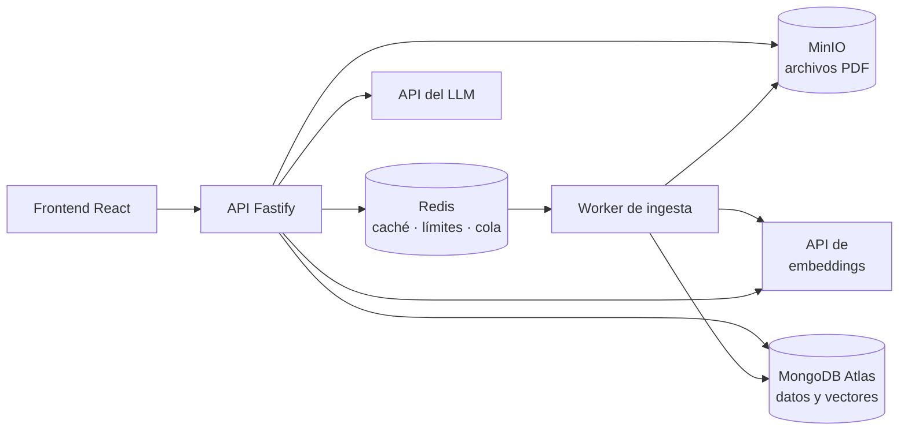

# DocQA

Asistente RAG sobre documentos: sube un PDF, pregúntale en lenguaje natural y recibe respuestas citadas por documento y página.

## Estado

En desarrollo. Tablero de tareas: [DocQA en Notion](https://app.notion.com/p/3e019c33c39081348924d13fbfd11d15). El frontend actual es un placeholder sin flujo funcional todavía (el registro/login, la subida de archivos y el chat no están implementados en la interfaz de usuario).

## Requisitos

El levantamiento completo está en [REQUIREMENTS.md](./REQUIREMENTS.md).

## Arquitectura



El sistema opera a través de dos flujos principales desacoplados:

- **Flujo de preguntas**: la API recibe la consulta y comprueba primero la caché en Redis. Si hay un fallo de caché (*cache miss*), genera el vector de la pregunta mediante la API de Voyage AI y ejecuta una búsqueda semántica vectorial en MongoDB Atlas, recuperando los 5 fragmentos más similares. Posteriormente, ensambla un prompt para Claude que aísla estrictamente las instrucciones del sistema respecto a los fragmentos de datos, envía la petición al LLM y persiste la respuesta generada asociándole sus citas exactas (documento y página), retornando el resultado con la cabecera `X-Cache`.
- **Flujo de ingesta**: al subir un archivo PDF validado estructuralmente, la API lo almacena en MinIO y encola un trabajo en BullMQ (Redis). El worker de ingesta toma el trabajo de forma asíncrona, extrae el texto página por página, lo divide en fragmentos semánticos (~800 tokens con 100 de solapamiento), genera sus representaciones vectoriales a través de Voyage AI y persiste los fragmentos y embeddings en MongoDB Atlas.

El aislamiento multi-usuario y multi-documento (RNF-01) se garantiza directamente a nivel de base de datos: el filtro por `userId` y `documentId` está declarado como campo de tipo `filter` dentro de la propia definición del índice vectorial de MongoDB Atlas (`chunks_vector_index`) y se evalúa internamente en la etapa `$vectorSearch` de agregación, descartando datos no autorizados en la búsqueda antes de devolver resultados.

## Stack

- **Frontend**: React 19.0.0, Vite 6.0.11, TanStack Query 5.65.1, TanStack Router 1.98.6, Tailwind CSS 4.0.3.
- **API**: Node.js 20.18.0, Fastify 5.2.1, TypeScript 5.7.3, Zod 3.24.1, BullMQ 5.34.6, ioredis 5.4.2, driver de MongoDB 6.21.0, cliente de MinIO 8.0.7, pdf-lib 1.17.1, @node-rs/argon2 2.2.1, @fastify/jwt 10.2.2, @fastify/cors 11.3.0, @fastify/helmet 13.1.1.
- **Worker de ingesta**: BullMQ 5.34.6, ioredis 5.4.2, driver de MongoDB 6.21.0, cliente de MinIO 8.0.7, unpdf 1.8.1 (extracción de texto), pdf-lib 1.17.1 (validación estructural).
- **Embeddings y LLM**: Voyage AI (modelo `voyage-3-lite`, 512 dimensiones), API de Claude (modelo `claude-haiku-4-5`).
- **Infraestructura y calidad**: MongoDB (`mongodb/mongodb-atlas-local:8.0.30`, con Vector Search incluido), Redis, MinIO, Turborepo 2.4.0, Vitest 3.0.5, ESLint 9.19.0, GitHub Actions, Docker Compose, pnpm 12.3.4.

## Cómo ejecutarlo

1. **Prerrequisitos**: Docker y Docker Compose, Node.js 20.18.0 (`nvm use`, ver `.nvmrc`), pnpm 12.3.4 vía Corepack (`corepack enable && corepack prepare pnpm@12.3.4 --activate`), y una API key de Voyage AI y otra de Anthropic (Claude).
2. **Variables de entorno**:
   ```bash
   cp .env.example .env
   ```
   Completar `VOYAGE_API_KEY` y `CLAUDE_API_KEY`, y generar `JWT_SECRET` (por ejemplo con `openssl rand -base64 48`, como ya sugiere el propio `.env.example`).
3. **Infraestructura** (MongoDB con Vector Search, Redis y MinIO — no las apps, ver la nota más abajo):
   ```bash
   docker compose up -d
   ```
4. **Dependencias**:
   ```bash
   pnpm install
   ```
5. **Apps en desarrollo** (API, worker y frontend en paralelo vía Turborepo):
   ```bash
   pnpm dev
   ```
6. **URLs**: API en [http://localhost:3000](http://localhost:3000), frontend en [http://localhost:5173](http://localhost:5173), consola de MinIO en [http://localhost:9001](http://localhost:9001) (usuario y contraseña según `MINIO_ROOT_USER`/`MINIO_ROOT_PASSWORD` en tu `.env`).
7. **Calidad y tests**:
   ```bash
   pnpm lint
   pnpm typecheck
   pnpm test
   pnpm test:coverage
   ```
   Integración (requiere MongoDB arriba):
   ```bash
   pnpm --filter @docqa/api test:integration
   pnpm --filter @docqa/worker test:integration
   ```

> `docker compose up` levanta solo la infraestructura (MongoDB, Redis, MinIO); `pnpm dev` levanta las tres aplicaciones sobre ella. Son dos comandos, no uno — ver la decisión registrada en [REQUIREMENTS.md, sección 10](./REQUIREMENTS.md#10-riesgos-y-decisiones-abiertas).

## Decisiones técnicas

**Autenticación (RF-01)**

- El token de renovación es un valor **opaco** aleatorio, no un JWT: su
  estado vive en MongoDB de todos modos, así que un JWT añadiría una segunda
  fuente de verdad que puede contradecir a la primera. Se guarda su hash
  SHA-256, nunca el token — y SHA-256, no Argon2, porque con 256 bits de
  entropía no hay diccionario que atacar; Argon2 es para secretos de baja
  entropía elegidos por humanos.
- Cada renovación **rota** el token: el usado queda inservible y se emite
  uno nuevo con la misma `familyId`. Si se reutiliza un token ya rotado, se
  interpreta como robo y se revoca la familia entera, no solo ese token.
  Compromiso conocido: dos pestañas refrescando en el mismo instante también
  matan la familia (`replacedByHash` ya está en el esquema para añadir una
  ventana de gracia si hiciera falta, sin migrar datos).
- `db/indexes.ts` crea los índices con `createIndex` en el arranque, que es
  idempotente salvo que cambien las opciones de un índice ya existente. Para
  este tamaño de proyecto es suficiente; en producción sería una migración
  versionada.

**Documentos (RF-02, RF-04)**

- Validación estructural real: no se confía en el `Content-Type` enviado por el
  cliente ni en la extensión del archivo. Se comprueban los magic bytes (`%PDF-`)
  para fallo rápido y se carga la estructura completa con `pdf-lib` (descartando
  archivos corruptos o cifrados) antes de persistir o encolar.
- Aislamiento directo en base de datos (RNF-01): `findById` y las consultas de
  documentos filtran por `_id` y `userId` en el mismo predicado de MongoDB,
  garantizando que ninguna consulta devuelva datos de otro usuario y retornando 404
  (sin delatar si el ID existe en otra cuenta).
- Claves de almacenamiento aleatorias (`${userId}/${uuid}.pdf`): el nombre en MinIO
  se desacopla del título del archivo original para evitar colisiones y vectores de
  path traversal.
- Orden de persistencia sin compensación: se almacena el blob en MinIO antes de
  insertar el registro en MongoDB; si falla la inserción en base de datos o el
  encolado, queda un blob huérfano inofensivo en MinIO, evitando registros
  rotos en la base de datos sin sobre-ingeniería de rollback.

**Embeddings (Voyage AI)**

- Modelo `voyage-3-lite`, 512 dimensiones, vía la API de Voyage AI.
- Motivos: Voyage es el proveedor de embeddings recomendado por Anthropic, lo que da una integración coherente con el resto del stack (la generación ya usa la API de Claude); su tier gratuito es amplio, así que la demo pública funciona sin pedir tarjeta de crédito; y 512 dimensiones pesan menos en el índice vectorial que las 1536 por defecto de OpenAI, ayudando a mantenerse dentro de los límites del tier gratuito de MongoDB Atlas.
- El modelo vive en la variable `EMBEDDINGS_MODEL`. Cambiarlo cambia las dimensiones del índice y obliga a regenerar los vectores existentes.

**MongoDB Atlas Vector Search**

- El índice vectorial sobre `chunks` (`chunks_vector_index`) se crea de forma idempotente al arrancar el worker (`ensureChunksVectorIndex`): si ya existe, no falla.
- El aislamiento por usuario y documento (RNF-01) no es un post-filtro en la aplicación: `userId` y `documentId` están declarados como campos `filter` dentro de la propia definición del índice, y `$vectorSearch` los aplica antes de calcular similitud, no después.
- `numCandidates` se calcula como ≈20 veces el `limit` solicitado (recomendación de Atlas para buen *recall* sin degradar la latencia), con un techo de 10000.

**Caché de respuestas (RNF-09)** — implementada

- Clave: SHA-256 de `userId:documentIds-ordenados:pregunta-normalizada:generación`, donde la pregunta se normaliza con `trim`, minúsculas y colapso de espacios (`apps/api/src/modules/cache/utils/cache-key.ts`).
- TTL: 24 horas (`CACHE_TTL_SECONDS`, en `apps/api/src/modules/cache/repositories/redis-response-cache.ts`).
- Invalidación sin `SCAN`/`DEL` masivo: un contador de "generación" por usuario en Redis (`cache:gen:<userId>`), incrementado con `INCR` al subir o borrar un documento (`DocumentService`). Como la generación forma parte de la clave, subir o borrar un documento invalida implícitamente todas las respuestas cacheadas de ese usuario.
- La cabecera `X-Cache` (`HIT`/`MISS`) se expone en `POST /conversations/:id/messages`.

**Rate limiting (RNF-04)** — pendiente

- Todavía no hay una dependencia de limitación de tasa (por ejemplo `@fastify/rate-limit`) ni código propio que limite peticiones por usuario en la API. Se documenta así de forma explícita en vez de darlo por hecho.

**Costos de las APIs**

- Modelo de generación pequeño y barato (`claude-haiku-4-5`).
- Límite de gasto configurado directamente en las cuentas de Anthropic y Voyage AI (fuera del repositorio).
- La caché de respuestas en Redis (RNF-09, ya implementada) reduce las llamadas repetidas al LLM y al servicio de embeddings.

**CI (RNF-12)**

- Dos jobs en paralelo: `checks` (lint, tipos, tests unitarios y cobertura de
  dominio en `api`) no depende de ningún servicio externo, así que da
  feedback en segundos; `integration` levanta un contenedor de MongoDB solo
  para las pruebas que sí lo necesitan (`test:integration`), sin frenar al
  primero.
- La cobertura del 80% (RNF-11) se comprueba con un script aparte,
  `test:coverage`, en vez de forzarla dentro del `test` normal — así seguir
  iterando en local con `pnpm test` no paga el costo de instrumentar
  cobertura en cada corrida.

## Demo

Pendiente de grabar: el frontend todavía no tiene el flujo de registro/login, subida de PDF y chat operativo (ver "Estado" arriba), así que por ahora no hay una demo interactiva que grabar.

<!-- TODO: grabar GIF de demo (subir PDF, hacer una pregunta, ver la respuesta citada) -->

## Uso de IA en el desarrollo

- **Desarrollo guiado por especificaciones**: la arquitectura, el modelado de datos y la implementación parten de [REQUIREMENTS.md](./REQUIREMENTS.md) (qué construir y por qué) y [CLAUDE.md](./CLAUDE.md) (convenciones y contexto permanente del repo), con Claude Code como asistente principal de desarrollo.
- **Orquestación multi-agente con revisión adversarial**: varias tareas de este repositorio, incluida la que generó este README, se implementaron delegando el trabajo de código a un agente CLI externo (Google Antigravity CLI, `agy`, sobre un modelo Gemini) orquestado por Claude Code, con los planes de implementación sometidos antes a una revisión adversarial por otro modelo Gemini que busca huecos, contradicciones y suposiciones sin verificar antes de aprobar la escritura de código.
- **Límite honesto**: el código y los documentos que produce un LLM se revisan y prueban igual que cualquier otro cambio, nunca se asumen correctos por venir de una IA. Este propio README es un ejemplo: el primer plan para escribirlo fue rechazado en la revisión adversarial por evitar corregir una contradicción real entre `REQUIREMENTS.md` y `docker-compose.yml` sobre el alcance de `docker compose up`; el plan corregido sí la resuelve (ver la sección 10 de `REQUIREMENTS.md`), y el primer borrador de este mismo README generado por el agente delegado también contenía un error de detalle (las credenciales de ejemplo de la consola de MinIO) que se corrigió antes de mergear, precisamente por no darlo por bueno sin revisar.
