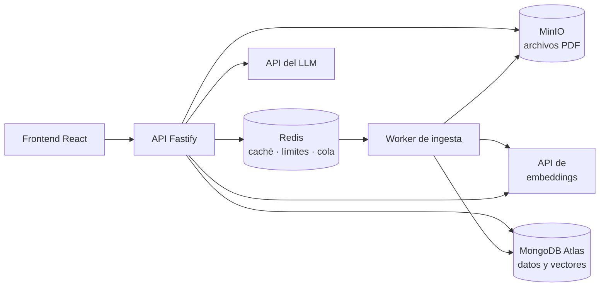

# Requisitos del MVP — DocQA: asistente RAG sobre documentos

2026-09-19 · @Someone

## 1. Resumen y objetivo

DocQA es una aplicación web donde cada usuario sube documentos PDF y hace preguntas en lenguaje natural; el sistema responde citando el documento y la página de donde sacó la información.

El objetivo es de portafolio: demostrar con código público las competencias que piden las vacantes fullstack con IA y que hoy no aparecen en el CV. En concreto: embeddings, búsqueda semántica, RAG, MongoDB, colas y caché con Redis, seguridad por usuario y CI/CD.

Meta: repositorio público en GitHub, README con GIF de demostración y, si es posible, una demo desplegada. Tiempo objetivo: 4 días de trabajo (dos fines de semana).

## 2. Alcance del MVP

El MVP cubre el ciclo completo de un solo tipo de archivo: subir un PDF con texto, procesarlo y preguntarle con respuestas citadas.

**Incluido**

- Registro e inicio de sesión con email y contraseña.
- Subida de PDF con texto seleccionable (máximo 10 MB y 50 páginas).
- Procesamiento en segundo plano: extracción de texto, fragmentación, embeddings e indexación.
- Preguntas sobre un documento o sobre todos los documentos propios.
- Respuestas con citas (documento, página y fragmento).
- Historial de conversaciones.
- Caché de respuestas y límite de peticiones con Redis.
- Borrado de un documento con todos sus fragmentos.

**Fuera del MVP**

- Archivos Word, imágenes o PDFs escaneados (requieren OCR).
- Compartir documentos entre usuarios o equipos.
- Reordenamiento de resultados (re-ranking) y evaluación automática de calidad.
- Interfaz en varios idiomas.
- Despliegue en Kubernetes.

## 3. Requisitos funcionales

Diez requisitos son imprescindibles para considerar terminado el MVP; los cuatro deseables se hacen solo si sobra tiempo.

### 3.1 Imprescindibles

| ID | Requisito |
| --- | --- |
| RF-01 | Registro e inicio de sesión con email y contraseña. Token de acceso de corta duración y token de renovación. |
| RF-02 | Subida de PDF con validación de tipo real del archivo, tamaño (10 MB) y número de páginas (50). |
| RF-03 | Procesamiento asíncrono en una cola: extraer texto por página, dividir en fragmentos de unos 800 tokens con 100 de solapamiento, generar embeddings y guardarlos. Estados del documento: procesando, listo, error. |
| RF-04 | Listado de los documentos propios con título, estado, número de páginas y fecha. |
| RF-05 | Hacer una pregunta sobre un documento concreto o sobre todos los documentos propios. |
| RF-06 | Recuperación por búsqueda vectorial: los 5 fragmentos más similares, siempre filtrados por usuario y, si aplica, por documento. |
| RF-07 | Generar la respuesta con un LLM usando solo los fragmentos recuperados. Si no hay información suficiente, decirlo explícitamente en lugar de inventar. |
| RF-08 | Cada respuesta muestra sus citas (documento y página); al pulsar una cita se ve el texto del fragmento. |
| RF-09 | Historial de conversaciones por usuario, con sus preguntas, respuestas y citas. |
| RF-10 | Borrar un documento elimina también su archivo, sus fragmentos y sus embeddings, e invalida la caché relacionada. |

### 3.2 Deseables

| ID | Requisito |
| --- | --- |
| RF-11 | Respuesta en streaming (Server-Sent Events) para que el texto aparezca mientras se genera. |
| RF-12 | Soporte para archivos Word (.docx). |
| RF-13 | Reordenamiento de los fragmentos recuperados antes de enviarlos al LLM. |
| RF-14 | Exportar una conversación con sus citas a Markdown. |

## 4. Requisitos no funcionales

La prioridad es el aislamiento entre usuarios: ninguna consulta, tampoco la vectorial, puede devolver datos de otra persona.

**Seguridad**

- RNF-01: Toda consulta a la base de datos, incluida la búsqueda vectorial, filtra por el usuario autenticado. Se prueba con un test automatizado.
- RNF-02: Contraseñas con hash (argon2 o bcrypt); nunca se guardan ni se registran en texto plano.
- RNF-03: Validación de todas las entradas con Zod; cabeceras de seguridad y CORS restringido.
- RNF-04: Límite de 20 preguntas por minuto por usuario con Redis; al superarlo, respuesta 429.
- RNF-05: El texto de los documentos se trata como datos, no como instrucciones. El prompt del sistema lo separa claramente para reducir la inyección de prompts.
- RNF-06: Secretos solo en variables de entorno, con un `.env.example` sin valores reales.

**Rendimiento**

- RNF-07: Respuesta a una pregunta en menos de 5 s (percentil 95) sin caché y en menos de 300 ms con caché.
- RNF-08: Un PDF de 50 páginas queda listo en menos de 60 s.
- RNF-09: Clave de caché = hash de usuario + documentos consultados + pregunta normalizada; duración de 24 h; se invalida al subir o borrar un documento del usuario.

**Calidad**

- RNF-10: TypeScript estricto en todo el proyecto.
- RNF-11: Tests con Vitest; cobertura mínima del 80% en la lógica de dominio (fragmentación, construcción del prompt, claves de caché, citas).
- RNF-12: GitHub Actions ejecuta lint, verificación de tipos y tests en cada push y pull request.
- RNF-13: Un solo comando (`docker compose up`) levanta todo el entorno local.

## 5. Arquitectura y stack

Un monorepo pnpm con tres piezas (frontend, API y worker de ingesta) sobre MongoDB, Redis, MinIO y un servicio de embeddings, todo levantado con Docker Compose.

Al preguntar, la API revisa la caché, genera el embedding de la pregunta, busca fragmentos en MongoDB, llama al LLM y guarda la respuesta con sus citas.

| Capa | Tecnología | Qué demuestra |
| --- | --- | --- |
| Frontend | React 19, Vite, TanStack Query y Router, Tailwind | Stack principal |
| API | Node.js, Fastify, TypeScript, Zod | Stack principal y validación |
| Cola y worker | BullMQ sobre Redis | Procesamiento asíncrono |
| Embeddings | API de embeddings (por ejemplo Voyage AI u OpenAI) | Embeddings y vectorización |
| Base de datos | MongoDB Atlas con Vector Search | MongoDB y búsqueda semántica |
| Caché y límites | Redis | Caché y rate limiting |
| Archivos | MinIO (compatible con S3) | Almacenamiento de objetos |
| Generación | API de Claude (modelo Haiku) u otro LLM | Integración de LLM |
| Calidad | Vitest, ESLint, GitHub Actions, Docker Compose | CI/CD y Docker |

Flujo de trabajo sugerido: desarrollo guiado por especificaciones con Claude Code, igual que en Sales Manager. Así el README puede incluir una sección sobre cómo usaste IA en el desarrollo.

## 6. Modelo de datos

Cuatro colecciones en MongoDB; los fragmentos guardan su propio `userId` para que la búsqueda vectorial pueda filtrar por usuario sin cruces.

| Colección | Campos principales | Notas |
| --- | --- | --- |
| `users` | `_id`, `email` (único), `passwordHash`, `createdAt` | Índice único en `email` |
| `documents` | `_id`, `userId`, `title`, `storageKey`, `pages`, `status` (processing, ready, error), `error`, `createdAt` | `storageKey` apunta al archivo en MinIO |
| `chunks` | `_id`, `userId`, `documentId`, `page`, `index`, `text`, `embedding` (vector; su tamaño depende del modelo de embeddings) | Índice vectorial en `embedding` con `userId` y `documentId` como filtros |
| `conversations` | `_id`, `userId`, `documentIds`, `messages` (rol, contenido, citas con `chunkId`, `documentId` y `page`), `createdAt` | Las citas permiten reabrir el fragmento exacto |

## 7. API

Doce endpoints REST; todos salvo registro, login, renovación y salud exigen token y operan solo sobre datos del usuario autenticado.

| Método | Ruta | Descripción |
| --- | --- | --- |
| POST | `/auth/register` | Crea un usuario |
| POST | `/auth/login` | Devuelve token de acceso y de renovación |
| POST | `/auth/refresh` | Renueva el token de acceso |
| POST | `/documents` | Sube un PDF (multipart) y lo encola para procesarlo |
| GET | `/documents` | Lista los documentos del usuario |
| GET | `/documents/:id` | Detalle y estado de un documento |
| DELETE | `/documents/:id` | Borra el documento, su archivo y sus fragmentos |
| POST | `/conversations` | Crea una conversación sobre uno o varios documentos |
| POST | `/conversations/:id/messages` | Envía una pregunta; devuelve la respuesta, sus citas y la cabecera `X-Cache` (HIT o MISS) |
| GET | `/conversations/:id` | Historial completo con citas |
| GET | `/chunks/:id` | Texto del fragmento citado |
| GET | `/health` | Estado de la API y sus dependencias |

## 8. Criterios de aceptación

El MVP está terminado cuando se cumplen todos estos puntos, comprobables por cualquier persona que clone el repositorio.

- [ ] Con `docker compose up` y el `.env.example` completado, la aplicación arranca desde cero en local.
- [ ] Un PDF de 20 páginas pasa a estado "listo" en menos de 60 s.
- [ ] Una pregunta cuya respuesta está en el PDF devuelve la respuesta y al menos una cita con la página correcta.
- [ ] Una pregunta sin respuesta en los documentos devuelve un mensaje de que no se encontró esa información, sin inventar.
- [ ] Un test automatizado demuestra que el usuario B no puede ver, consultar ni recuperar fragmentos de documentos del usuario A.
- [ ] Repetir la misma pregunta responde desde caché en menos de 300 ms, con `X-Cache: HIT`.
- [ ] La pregunta número 21 dentro de un minuto devuelve 429.
- [ ] Borrar un documento hace que deje de aparecer en respuestas y citas.
- [ ] GitHub Actions en verde: lint, tipos y tests con la cobertura mínima.
- [ ] README con arquitectura, cómo ejecutarlo, decisiones técnicas, GIF de demostración y una sección sobre el uso de IA en el desarrollo.

## 9. Plan por fases

Cuatro fases de un día cada una; al final de cada fase el repositorio queda en un estado que se puede mostrar.

| Fase | Entregable | Requisitos | Duración |
| --- | --- | --- | --- |
| 1. Base | Monorepo pnpm, Docker Compose (MongoDB, Redis, MinIO), autenticación y CI funcionando | RF-01, RNF-02, RNF-06, RNF-10, RNF-12, RNF-13 | 1 día |
| 2. Ingesta | Subida de PDF, cola BullMQ, extracción, fragmentación, embeddings e índice vectorial | RF-02, RF-03, RF-04, RF-10, RNF-08 | 1 día |
| 3. Preguntas | Búsqueda vectorial filtrada, prompt, llamada al LLM, citas e historial | RF-05 a RF-09, RNF-01, RNF-05 | 1 día |
| 4. Pulido | Caché, rate limiting, test de aislamiento, interfaz, README con GIF y despliegue | RNF-04, RNF-07, RNF-09, RNF-11 | 1 día |

Si la fase 4 se alarga, se puede publicar el repositorio sin despliegue: el README con GIF ya demuestra el proyecto ante un reclutador.

## 10. Riesgos y decisiones abiertas

Decidido: los embeddings se generan con una API desde el inicio. Los riesgos principales pasan a ser el costo de las APIs y la dependencia de un proveedor.

- **Embeddings locales o por API.** Decidido: API de embeddings desde el inicio, así la demo pública funciona sin cambios. El modelo se elige en la fase 2 y se guarda en la configuración. Cambiar de modelo cambia las dimensiones del índice y obliga a regenerar los vectores.
- **Límites de MongoDB Atlas gratuito.** La capa gratuita tiene límites de almacenamiento e índices. Hay que confirmar al inicio que el índice vectorial funciona ahí, o usar un despliegue local con Atlas CLI. pgvector sería más simple, pero no cubriría la brecha de MongoDB del CV.
- **Costo de las APIs (LLM y embeddings).** Usar un modelo pequeño, fijar un límite de gasto en la cuenta y apoyarse en la caché de Redis.
- **Inyección de prompts desde los documentos.** Se mitiga con RNF-05 y porque el sistema no ejecuta acciones: solo responde texto.
- **PDFs escaneados.** Quedan fuera de alcance; si no tienen texto extraíble, el documento pasa a estado "error" con un mensaje claro.
- **Dónde desplegar la demo.** Opciones como Render, Railway o Fly.io; se decide en la fase 4.
